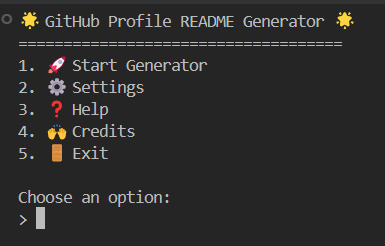

<h1 align="center">🚀 GitHub Profile README Generator</h1>

<p align="center">
  
</p>

<p align="center">
  
  
  
</p>

---

### 💡 What is this?

This is an advanced terminal-based tool that helps you create a standout, fully customizable `README.md` for your GitHub profile — with **stats**, **gifs**, **Devicon support**, **typing banners**, and more. It includes:

- 🎨 GitHub Stats Cards (Themes + Streaks)
- 🧰 All Devicon programming tools/languages
- 💬 Custom quotes & bio section
- 🖼️ Add animated gif banners
- 🚀 Supports visitor counter, badges & more
- 🧠 Profanity filtering & GitHub profile validation
- 💾 Settings stored between uses (via JSON)
- ✅ Outputs a ready-to-paste `README.md`

---

### 📸 Preview

<p align="center">
  
</p>

---

### ⚙️ How to Use

#### 🖥️ For Windows:
1. Double-click `run.bat`
2. Follow the prompts

#### 💻 For Mac/Linux:
```bash
git clone https://github.com/Kieranmcm07/GitHub-Profile-README-Generator
cd GitHub-Profile-README-Generator
python -m pip install requests better_profanity
python generate_devicon_json.py
python GitHub_ReadMe_Generator.py
```

---

### 🪄 Windows Setup Wizard (EXE version coming soon!)
> No python required - just double click and starts. Enjoy it guys.

---

### 🧩 Features
- 🔧Powerful settings menu.
- ✨Lots of customisation options.
- 🧠Built-in help and guidance for end-users.
- 💥Clean simple ASCII style interface.
- ✅Fully offline support after setup.

---

### Created with ⚡ by Kieranmcm07

### 🙌 Credits

- Created by [Kieran McMonagle](https://github.com/Kieranmcm07)
- Devicon by [@devicon](https://github.com/devicons/devicon)
- GitHub Stats Card by [@anuraghazra](https://github.com/anuraghazra/github-readme-stats)
- Typing SVG by [@DenverCoder1](https://github.com/DenverCoder1/readme-typing-svg)
- Profanity chcker via [better_profanity](https://pypi.org/project/better-profanity/)

---

### 📜 LICENSE
```
MIT License

Copyright (c) 2025 Kieran McMonagle

Permission is hereby granted, free of charge, to any person obtaining a copy
of this software and associated documentation files (the "Software"), to deal
in the Software without restriction, including without limitation the rights
to use, copy, modify, merge, publish, distribute, sublicense, and/or sell
copies of the Software, and to permit persons to whom the Software is
furnished to do so, subject to the following conditions:

The above copyright notice and this permission notice shall be included in all
copies or substantial portions of the Software.

THE SOFTWARE IS PROVIDED "AS IS", WITHOUT WARRANTY OF ANY KIND, EXPRESS OR
IMPLIED, INCLUDING BUT NOT LIMITED TO THE WARRANTIES OF MERCHANTABILITY,
FITNESS FOR A PARTICULAR PURPOSE AND NONINFRINGEMENT. IN NO EVENT SHALL THE
AUTHORS OR COPYRIGHT HOLDERS BE LIABLE FOR ANY CLAIM, DAMAGES OR OTHER
LIABILITY, WHETHER IN AN ACTION OF CONTRACT, TORT OR OTHERWISE, ARISING FROM,
OUT OF OR IN CONNECTION WITH THE SOFTWARE OR THE USE OR OTHER DEALINGS IN THE
SOFTWARE.
```
